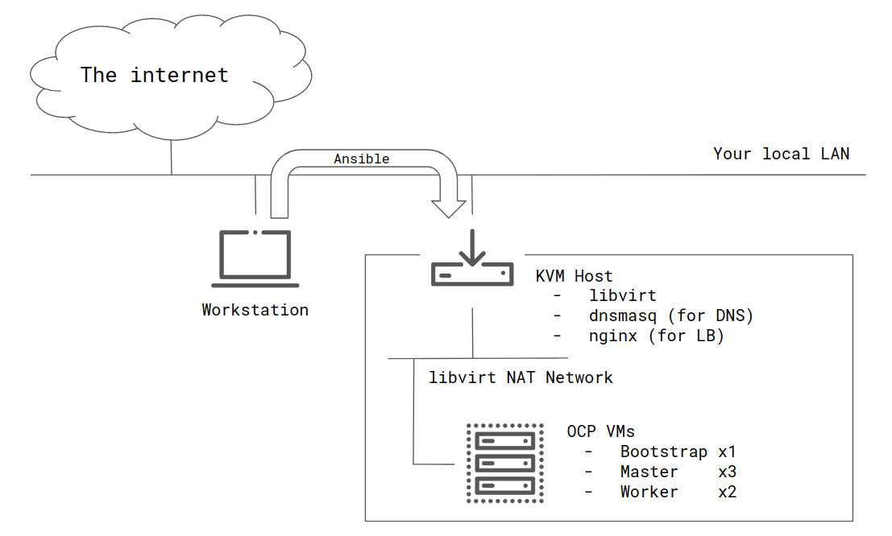

# openshift-ansible-kvm

This repository contains Ansible playbooks for UPI installation of OpenShift 4 on KVM.

It supports both [OpenShift Container Platform 4(OCP4)](https://www.openshift.com/) and [OKD 4](https://www.okd.io/) deployments.

Note: This configuration is for disposable test and does not support production use.

## Requirements

- Workstation (or call it base node, control node...), The machine that runs Ansible. It is typically your laptop.
    - Tested on Fedora and RHEL8.
    - Ansible >= 2.8
    - This node **is not** mandatory. You can run the script on a single KVM host if you want.
- KVM host
    - RHEL 8.2
    - CPU with at least 4 cores
    - Memory with at least 80 GB
        - It will work with about 64 GB with memory overcommit, but we don't recommend it.
    - Check [resource requirements](https://access.redhat.com/documentation/en-us/openshift_container_platform/4.5/html/installing_on_bare_metal/installing-on-bare-metal#installation-requirements-user-infra_installing-bare-metal) for more details.

## Architecture



It can also be run with just the KVM host, without the workstation. (In that case, install Ansible on the KVM host)

## Quickstart

### Install ansible on your Workstation

```bash
$ sudo dnf install -y ansible
```

### Prepare KVM host

- Just install RHEL8
- Add ssh public key of the workstation to kvm host root user's `.ssh/authorized_keys`

### Make your settings

Create your settings based on the samples.
At least change the following settings are **required** .

- `vars/config.yml`
    - `kvm_host:`
        - `ip:` Your KVM host IP
        - `if:` Your KVM host IF name (e.g. `enp2s0f0` )
    - `openshift:`
        - `dist:` Select the distribution to deploy `ocp` or `okd`
        - `install_version:` openshift-install and openshift-client version
        - `coreos_version:` CoreOS version
        - `okd_*_sha256:` (okd only) FOCS does not provide sha256sum.txt, so you have to check and input it yourself from [the official website](https://getfedora.org/en/coreos/download?tab=metal_virtualized&stream=stable).
    - `key:`
        - `pullsecret`  : Get form [cloud.redhat.com](https://cloud.redhat.com/openshift/install/metal/user-provisioned)
        - `sshkey`      : Your ssh pub key
- `inventory/hosts`
    - `[kvm_host]`    : Your KVM host IP (or localhost)

```bash
$ cp vars/config.yml.sample vars/config.yml
$ cp inventory/hosts.sample inventory/hosts
```

### Run

```bash
$ ansible-playbook ./main.yml
```

## FAQ

### How do I connect to the OCP web console from the workstation?

You cannot access directly to NAT network of libvirtd from your workstation.
But you can access it using ssh port forwarding and socks5, for example.
 
```
[user@workstation] $ ssh root@KVM-HOST -ND 127.0.0.1:8888
```

Then add `127.0.0.1:8888` (socks5) to your browser's Proxy and access `https://console-openshift-console.apps.test.lab.local`.
Depending on your browser, you may need to enable the RemoteDNS option.
 
Other ways, you can use [sshuttle](https://fedoramagazine.org/use-sshuttle-to-build-a-poor-mans-vpn/).

### Something is wrong? - clean up environment

```bash
$ ansible-playbook ./03_cleanup.yml
```

## Special Thanks

This project started with inspiration from openshift-fast-install. ( [the original version](https://github.com/konono/openshift-fast-install) and [the forked version](https://github.com/masaki-furuta/openshift-fast-install) )
